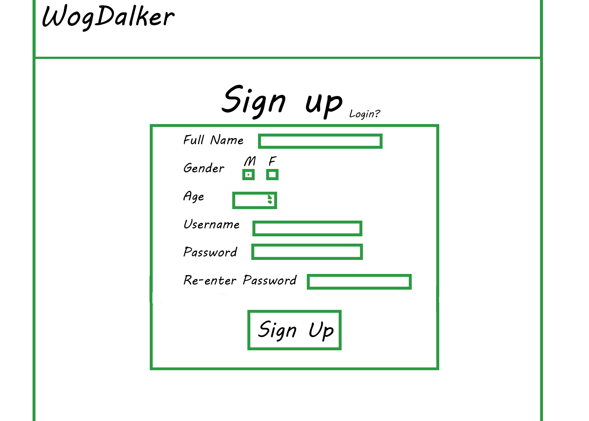
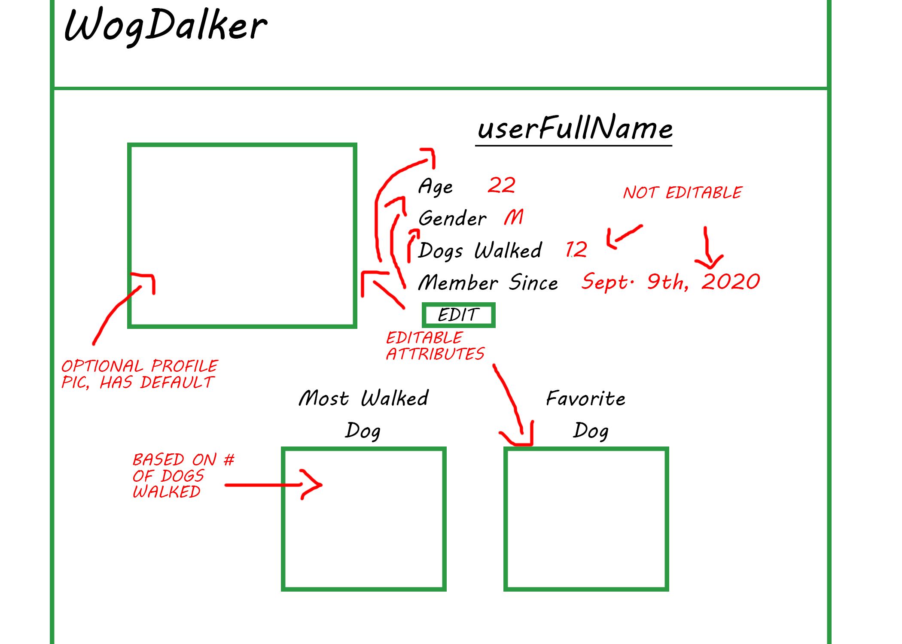
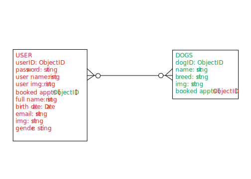

# walk-with-me

## HEADLINE
"Walk With Me" is a simple online application that allows users to sign up to walk dogs at RescuePup, our fictional dog shelter.

## ABOUT THIS PROJECT
Given the paramaters we received for the creation of our CRUD/database application, we tried to conceive of a real-world problem that could be solved using the technologies and skills that we have learned.  Unloved dogs without responsible owners and homes are an ongoing concern in the United States with roughly 3.3 million dogs entering shelter care every year. Just like any animal, these dogs need exercise and this is a tough job to be handled exclusively by shelter employees.  "walk-with-me" uses express, passport, ejs and MongoDB to provide a web-based application that the general public can use to volunteer and walk shelter dogs at a specific calendered time, thereby increasing the health and wellbeing of shelter dogs and reducing strain on shelter finances and administration.  

This project presented some  unique challenges for us, particularly as it required each of us to work with another developer on a project for the first time.  Github and Heroku required a great deal of learning on our part.  We have included our wireframes, user stories and database model below so that users may more deeply inform themselves of our project.

## WIRE FRAMES
- **Landing page** 

- **Login page** 

- **Signup page** 

- **Dog index page** 

- **User index page** 

- **User page** 

- **Dog page** 

- **Booking page** 

## MVP User Stories
- Upon arriving onsite, viewers will be presented with a login page with RescuePup look and feel that allows a user to login with their own personal credentials.
- Viewers who have not previously registered will be presented with the option to navigate to a registration page where they can establish login credentials and become users.
- After succesfully logging in, users will be presented with their personal profile screen that shows their user details and presents them with links to other pages of the application.
- One such page will be an edit page that allows the user to edit or delete their information.
- One page will show the users walk schedule.
- One page will provide a visual index of all of the shelter dogs that are avialable to be walked.
- Clicking on one of these dogs will bring up a profile page for that individual dog, which will display that dog's relevant information
- Interacting with a dog's profile page will allow the user to schedule an appointment to walk that individual dog
- Upcoming dog appointments will be viewable on the users schedule page.

## Database Model

## Stretch User Stories
- users can pick a day to schedule their walk
- users can book a specific time to schedule their walk
- users can make multiple appointments and view them all in the portal.
- schedule/available appointments will reflect the calendar, with the schedule losing one day and gaining one day every 24 hours.
- schedule/available appointments will reflect the real world calendar
- application will have a web interface for key personnel to update dog database.
- application will perform properly on mobile devices
- application styling and functionality will be flexible enough to be marketed to real life shelters with their own branding and resources.
- application can be capably issued to apple App Store and Google Play
